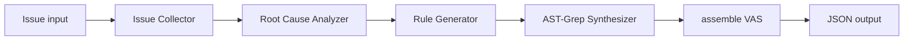

# VAMiner Agent Runtime：SDK 与 Agent CLI 双运行时

> 状态：架构头脑风暴，不包含代码修改
>
> 日期：2026-07-24
>
> 核心结论：SDK 与 Agent CLI 作为两种一等调用方式长期共存；不把“删除 SDK”作为迁移目标。

相关文档：

- [增量 Rule 演进](brainstorm_incremental_rule_evolution.md)
- [缺陷场景与 GoodCase/BadCase 输入](brainstorm_case_bundle_input.md)

## 1. 决策摘要

把 Codex、OpenCode、Claude Code 一类 CLI 用作 Miner 的 Agent 基座是可行的，但不应让各 phase 直接拼命令行。推荐增加一个小 interface、深 implementation 的 `Agent Runtime` seam：

```text
Miner phase
    -> AgentTask
    -> AgentRuntime
        -> SDK adapter
        -> Codex CLI adapter
        -> OpenCode CLI adapter
        -> Claude CLI adapter
    -> AgentRunResult
    -> 当前 Pydantic schema 校验
```

关键决策：

1. SDK 与 CLI 都是一等 adapter，可按 phase 选择，也可互为 fallback 或 shadow runner。
2. instruction、输入 artifact、权限、输出 schema 由 VAMiner 定义；adapter 只负责执行。
3. CLI 的差异通过 capability 声明处理，不追求一个“最低能力公约数”。
4. 确定性 fetch、clone、保存、coverage 和发布留在 Python orchestration 中。
5. cache key 保持简单：`phase:runtime:model`。
6. 不记录 SDK/CLI 版本，不把 instruction、input、schema digest 塞进 cache key。
7. cache 只是节省重复调用的便利层，不承担严格复现；需要失效时显式 `--refresh-cache`。

这意味着当前仓库需要重构 Miner orchestration，但不需要推倒 instructions、Pydantic contract、case extraction、anchor synthesis、scanner 和 runner。

## 2. 当前实现与主要 gap

当前主链路大致是：



与运行时相关的主要位置：

- `src/miner/main.py`：phase orchestration 直接调用当前 Agent runner。
- `src/miner/core/agents.py`：SDK Agent、SandboxAgent、MCP 与 nested-agent tool 的构造。
- `src/miner/configs.py`：client、model 与 tracing 配置。
- `src/miner/utils/models.py`：Agent 输出的 Pydantic contract。
- `src/miner/utils/workspace.py`：repo、cases、cache 与报告工作区。
- CLI adapter 将在独立 runner 项目中开发；本仓库只保留 Miner 与可部署 scanner skill。

当前深度主要集中在 SDK implementation：

- typed function tools；
- `output_type` 结构化输出；
- sandbox mount；
- nested Agent 共享 session；
- MCP 生命周期；
- retry、event、trace 与 model error。

若直接在 `main.py` 中用 `subprocess.run()` 替换 SDK，上述复杂度会泄漏到每个 phase：每个调用点都要理解 stdout、stderr、schema 修复、超时、进程组、权限和不同 CLI 参数。这会形成多个 shallow module，而不是一个可替换的运行时。

## 3. SDK 与 CLI 为什么应该共存

两者不是简单的“旧方式”和“新方式”。

### 3.1 SDK 的长期价值

- typed tool 与 structured output 的契约更直接；
- Python 进程内事件、trace 和错误分类更容易统一；
- 适合低权限、严格 schema、无需完整 coding harness 的任务；
- 当前实现已经可用，保留它能降低迁移风险。

### 3.2 Agent CLI 的长期价值

- 复用成熟 coding agent 的检索、shell、skills、MCP 和上下文管理；
- 可以按用户已有的 CLI 环境运行；
- 对 repo RCA、代码导航和 anchor synthesis 一类 coding task 更自然；
- 允许 Miner 跨厂商、跨模型按 phase 路由。

### 3.3 共存带来的架构收益

```toml
default_runtime = "sdk"

[phase_runtime]
issue_collection = "sdk"
root_cause = "codex"
rule_generation = "sdk"
merge_judge = "sdk"
anchor_synthesis = "opencode"
```

这样：

- 新 CLI 可以先 shadow，不影响 active 结果；
- 某 CLI 不具备所需能力时可以明确 fallback；
- 同一份 eval corpus 可以比较 SDK/CLI 的质量、延迟和成本；
- Rule 生命周期不绑定任何单一模型厂商；
- 后续加入新的 adapter 不需要修改领域流程。

## 4. 推荐的 Agent Runtime interface

### 4.1 `AgentTask`

概念字段：

```text
AgentTask
  task_id
  phase
  instruction_bundle
  input_payload
  artifact_references
  workspace_manifest
  permission_profile
  output_schema
  timeout_policy
  retry_policy
  runtime_hint
  model_hint
  persistence_policy
```

这里不应携带 Rule merge 或 RCA 的领域逻辑。`AgentTask` 只表达“一次受约束的认知任务怎样被执行”。

### 4.2 `AgentRunResult`

概念字段：

```text
AgentRunResult
  status
  final_text
  structured_output
  normalized_events
  usage_if_available
  session_id_if_available
  exit_code / signal / timeout
  stdout_artifact
  stderr_artifact
  runtime
  model
```

`runtime + model` 足以支持日常排查与简单 cache 隔离。这里没有必要强制保存运行时版本；真正用于业务的输出仍由当前 schema 校验。

### 4.3 Adapter capability

每个 adapter 声明自己支持的能力：

- `structured_output`
- `event_stream`
- `resume`
- `ephemeral_session`
- `native_read_only`
- `native_workspace_write`
- `mcp`
- `skills`
- `server_mode`
- `usage_reporting`

Task 声明 required capability。不满足时：

1. 使用配置中的 fallback adapter；或
2. 明确失败。

不能静默降低结构化输出、权限或持久化要求。

## 5. CLI 并不存在统一的 `-p`

实现 adapter 时不要假设所有 CLI 都有同一调用协议：

| Runtime | 非交互形态 | 机器输出 | 结构化输出特点 |
|---|---|---|---|
| Codex | `codex exec` | JSONL/final message | 可请求输出 schema |
| OpenCode | `opencode run` | JSON events | 需要 VAMiner 做后验 schema 校验与纠错 |
| Claude Code | `claude -p` | JSON/stream-json | 可请求 JSON schema |
| SDK | Python 调用 | typed event/result | 原生接入 Pydantic contract |

因此 CLI adapter 的职责不是只拼参数，而是把厂商协议归一成 `AgentRunResult`。具体参数属于各 adapter implementation，不应成为 Miner phase 的知识。

## 6. 工作区与权限

VAMiner 应定义跨 adapter 一致的工作区语义：

| Phase | Repo | Cases/output | Network | Shell |
|---|---|---|---|---|
| Issue collection | 可无 | 写 collection artifact | 是 | 最小 |
| Repo RCA | 只读 | 只写本 evidence cases | 否 | 是 |
| CaseBundle RCA | 可无 | 只读原始输入、写归一化 artifact | 否 | 是 |
| Rule semantics | 可选只读 | 只读 | 否 | 可选 |
| Anchor synthesis | 可选只读 | temp 可写 | 否 | 限检索与 ast-grep |
| Merge judge | 无需完整 repo | 只读 evidence/rules | 否 | 否 |
| Compile/validation | 只读 corpus | draft revision 可写 | 否 | 确定性命令 |

CLI 自带 sandbox 可以作为额外防护，但共同语义仍应由 VAMiner 保证：

- 子进程组超时后按 `TERM -> grace period -> KILL` 清理；
- stdout、stderr 和 event stream 有体积上限；
- 环境变量使用 allowlist，并对日志做 secret redaction；
- 默认 ephemeral/no-session-persistence；
- repo 中 `AGENTS.md`、`CLAUDE.md` 等 instruction 是否加载必须由 task policy 决定；
- 用户级 skill/plugin 是否允许参与必须显式配置。

## 7. 结构化输出策略

结构化输出应是 Runtime seam 的共同 contract，而不是某个 CLI 的特性。

建议流程：

```text
native schema request（若支持）
    -> final output extraction
    -> JSON parse
    -> 当前 Pydantic model 校验
    -> 一次受限 correction turn（可选）
    -> success 或保留 artifact 后失败
```

原则：

- CLI stdout 不能直接成为 active Rule。
- markdown fence、日志、event 与 final JSON 必须由 adapter 分离。
- correction turn 只能纠正格式，不应偷偷改变领域结论。
- correction 后仍失败则终止该 phase，不将部分对象写入发布目录。

## 8. Tools 与 nested Agent

### 8.1 Tools

推荐把确定性行为与 Agent 推理分开：

- Python orchestration：fetch CVE/issue、clone、checkout、digest、保存、coverage、发布。
- Agent Runtime：RCA、semantic fingerprint、compatibility judge、RuleDelta、anchor intent。

当前 tool function 若同时包含领域行为和 SDK decorator，应逐步拆成：

```text
plain Python implementation
    -> SDK tool adapter
    -> 可选 MCP adapter
```

不建议让 Codex、OpenCode、Claude 分别通过 shell 重写 fetch/clone 逻辑。这会损害 locality，也会重复鉴权与错误处理。

### 8.2 AST-Grep Synthesizer

当前 nested agent-as-tool 是最 SDK-specific 的部分，但它已有清楚的 request/result contract。可改成显式 phase：

```text
Rule semantic draft
    -> AnchorSynthesisRequest
    -> bounded fan-out: one AnchorSynthesisRunRequest per intent
    -> AgentRuntime.run(anchor-synthesis) per isolated intent
    -> deterministic ordering, coverage, and repository-evidence aggregation
    -> AnchorSynthesisResult
    -> atomic batch acceptance
```

“是否支持 subagent”不应成为 Runtime 的必备能力。nested Agent 可以是单个 adapter 内部的性能优化，不能影响正确性。

## 9. Cache：保持有意的简单

### 9.1 Key

Workspace 已经按 source/evidence 隔离，因此 cache namespace 只保留：

```text
phase:runtime:model
```

例如：

```text
root_cause:sdk:gpt-5
root_cause:codex:gpt-5
anchor_synthesis:opencode:claude-sonnet
```

### 9.2 明确不加入的内容

- SDK/CLI 版本；
- instruction digest；
- input digest；
- output schema digest；
- capability digest；
- 用户配置 digest。

这些字段会把一个节省调用成本的 cache 变成复现系统，复杂度和维护成本不符合当前需要。

### 9.3 失效语义

- cache 命中后，用当前 Pydantic schema 再校验；
- 校验失败即视为 miss；
- instruction 或 schema 有明显变化时使用 `--refresh-cache`；
- 比较 runtime 时使用不同 `runtime` namespace；
- cache 失败不能阻止正常执行。

因此它的定位很清楚：**best-effort reuse，而不是严格 reproducibility**。

## 10. 迁移影响

高影响：

- `src/miner/main.py`：从直接管理 SDK lifecycle 转成 phase orchestration。
- `src/miner/core/agents.py`：当前 factory 收入 SDK adapter implementation。
- `src/miner/configs.py`：改为 lazy runtime config，避免 import 时强制初始化某一 SDK。
- hooks/logger：归一成 runtime event/artifact recorder。
- tool functions：领域 implementation 与 SDK wrapper 分离。

可保留：

- 各 phase instruction；
- Pydantic 领域模型及严格校验思路；
- RCA case extraction；
- AST-Grep synthesis request/result；
- anchor engine 与 report；
- scanner state machine；
- runner 中已有的 OpenCode 进程管理经验。

所以这是明显重构，但不是仓库级重写。

## 11. 推荐落地顺序

1. 固定代表性 eval corpus 和 phase 质量指标。
2. 定义 `AgentTask / AgentRunResult`。
3. 把当前 SDK 包装成第一个 adapter，行为保持不变。
4. 将 AST-Grep Synthesizer 变为显式 phase。
5. 增加一个 CLI adapter，先 shadow 一个 phase。
6. 比较 schema success、RCA factuality、case 质量、anchor coverage、延迟与成本。
7. 达标后开放按 phase routing。
8. 再补 fallback；不要在第一版同时实现所有 CLI。

## 12. 风险与约束

| 风险 | 控制方式 |
|---|---|
| CLI 用户配置导致机器间差异 | 默认隔离配置；允许项显式声明 |
| CLI 退出成功但没有合法 final JSON | adapter 提取后再做 Pydantic 校验 |
| 子进程超时留下孙进程 | 进程组清理 |
| repo instruction 污染 Miner instruction | 默认不加载，按 task policy allow |
| SDK/CLI 输出质量不同 | 同 corpus shadow eval，按 phase 路由 |
| fallback 隐藏能力缺失 | capability mismatch 必须被记录 |
| cache 陈旧 | 当前 schema 校验 + 显式 refresh |

## 13. 最终建议

最稳妥的目标不是“把 OpenAI SDK 换成 CLI”，而是：

> 让 VAMiner 的领域流程只依赖 `AgentRuntime` interface，使 SDK、Codex、OpenCode、Claude 都成为可选择的 implementation。

第一阶段只需要 SDK adapter + 一个 CLI adapter。cache 保持 `phase:runtime:model` 即可；版本和 digest 不进入这套设计。
