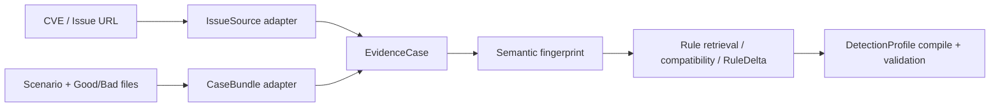
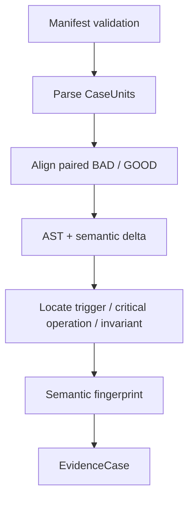

# VAMiner 缺陷场景与 GoodCase/BadCase 输入适配

> 状态：架构头脑风暴，不包含代码修改
>
> 日期：2026-07-24
>
> 核心结论：把 benchmark-style GoodCase/BadCase 视为独立的 `CaseBundle` 证据来源，不要伪装成缺少字段的 CVE/Issue。

相关文档：

- [SDK 与 Agent CLI 双运行时](brainstorm_agent_runtime.md)
- [增量 Rule 演进](brainstorm_incremental_rule_evolution.md)

## 1. 场景与结论

新增输入可能包含：

- 一段缺陷场景描述；
- 一个或多个 BadCase；
- 一个或多个 GoodCase；
- Good/Bad 位于同一文件的不同函数，或位于不同文件；
- 可选的配对关系、benchmark id、语言和辅助文件；
- 不一定有 issue URL、repo、buggy commit 或 fixed commit。

推荐将入口扩展为两个 source adapter：



不要把 CaseBundle 填入当前 `IssueCollectionInfo` 并给 `repo_url`、`buggy_commit`、`fixed_commit` 塞空字符串。那会制造错误不变量，之后每个 phase 都要猜“空 commit 到底是什么意思”。

## 2. 当前实现的主要 gap

当前工作流天然假设：

- CLI positional input 是 `issue_input`；
- Issue Collector 能得到 repo URL 与 buggy/fixed commit；
- RCA 可以访问 buggy/fixed branches；
- case extraction 主要产生 buggy original 与变体；
- Rule Generator 和 AST-Grep Synthesizer 可以读取 repo 与 cases；
- `AnchorSynthesisResult.repo_evidence` 至少有一项；
- workspace 和报告可以扫描完整 repo。

而 CaseBundle 可能：

- 完全没有 repo；
- 没有 commit diff；
- 已经显式提供 BAD 与 GOOD；
- 同一个文件同时包含正负样例；
- GoodCase 只是 negative control，不一定代表真实 fix；
- benchmark 的函数名、文件名和注释可能直接泄漏标签。

本地 `data/cwe-bench-jave.csv` 当前只是 CVE/commit 索引，没有 Good/Bad 源码或 case 边界。因此它不能直接替代 CaseBundle manifest；需要一个独立的输入 contract。

## 3. 先分清三个概念

### 3.1 Source

一次外部输入：

- `IssueSource`
- `CaseBundleSource`

它负责 provenance，不直接等价于一条 Rule。

### 3.2 `EvidenceCase`

一个独立 root cause 的证据记录。一份 CaseBundle 若混有两个缺陷机制，应拆成两个 EvidenceCase。

### 3.3 `CaseUnit`

一段带预期语义的代码证据：

```text
CaseUnit
  case_id
  verdict: BAD | GOOD
  language
  files
  entrypoint / selector
  pair_id optional
  relation optional
  description optional
  provenance
```

`EvidenceCase` 是规则演进的证据单位；`CaseUnit` 是代码分析与验证的样例单位。不要都叫 “case” 而不区分层次。

## 4. 推荐输入：Manifest + 文件 Bundle

文件名推断可以作为 importer 便利，但归一化以后必须有显式 manifest。建议支持 YAML 或 JSON。

同文件 Good/Bad 示例：

```yaml
kind: case_bundle
case_bundle_id: path-normalization-001
title: Path authorization must use the normalized path
scenario: >
  Authorization is checked on a non-normalized path while the later file
  operation resolves an equivalent normalized path.
language: java

cases:
  - id: bad-1
    verdict: BAD
    path: PathCases.java
    selector:
      symbol: badTraversalCheck
    pair_id: pair-1
    relation: vulnerable

  - id: good-1
    verdict: GOOD
    path: PathCases.java
    selector:
      symbol: goodTraversalCheck
    pair_id: pair-1
    relation: paired_fix
```

不同文件示例：

```yaml
kind: case_bundle
case_bundle_id: path-normalization-002
title: Path authorization must use the normalized path
scenario: Authorization and use must observe the same normalized identity.
language: java

cases:
  - id: bad-1
    verdict: BAD
    path: bad/PathCheck.java
    pair_id: pair-1
  - id: good-1
    verdict: GOOD
    path: good/PathCheck.java
    pair_id: pair-1
    relation: paired_fix
```

一个逻辑 case 需要多个源文件时，可以把 `path` 提升为 `files[]`，并指定：

- `entrypoint_file`
- `entrypoint_symbol`
- dependency files

MVP 可以先限制为单语言 bundle；混合语言输入先拆 bundle，避免第一版同时处理跨语言编译。

## 5. Selector：同文件 Good/Bad 的关键

若 Good 与 Bad 在同一文件，文件级标签是错误模型。需要为每个 CaseUnit 标出范围：

推荐优先级：

1. AST/symbol selector：类、方法、函数；
2. region selector：`start_line/end_line`；
3. whole file：只适用于整个文件只有一个 verdict。

原因：

- symbol 比行号更抗格式化和注释变化；
- region 可兼容无法解析或没有符号的片段；
- whole-file label 无法表示同文件正负样例。

归一化阶段应：

1. 解析 selector；
2. 得到稳定的 source span；
3. 检查同一文件中 selector 是否重叠；
4. 保存原始文件和归一化 span；
5. 给 Agent 提供目标 span 及必要的有界上下文。

重叠不是一定非法，但必须显式声明关系；否则应拒绝，避免同一行同时被当作 GOOD 和 BAD。

## 6. GoodCase 并不自动等于 safe condition

这是该输入模式最容易做错的地方。

### 6.1 建议区分 GoodCase 关系

| relation | 含义 | 对 Rule 的作用 |
|---|---|---|
| `paired_fix` | 与某个 BadCase 同意图、同环境的修复版 | 强 safe evidence，可帮助提取 fix guarantee |
| `negative_control` | 经过同一 hotspot，但满足必要不变量 | 强判别证据；anchor 可以命中，但 analyzer 不应报警 |
| `non_triggering_variant` | 只缺少某个 trigger | 帮助界定 trigger，safe 证据较弱 |
| `unrelated_good` | 仅是 benchmark 中的普通负例 | 只用于验证噪声，不应生成 safe scenario |

若 manifest 没给 relation，可由比较式 RCA 提出推断和置信度，但不能把所有 `GOOD` 默认解释成“官方修复”。

### 6.2 Safe 信息不足时允许 unknown

- 只有 BadCase：可以生成缺陷 fingerprint 和 unsafe scenario，但 `fix_guarantee` / safe pattern 可为 unknown。
- 只有 GoodCase：不足以挖掘缺陷 Rule，应拒绝或只作为已有 Rule 的回归语料。
- Good 与 Bad 不可比较：Good 作为 negative validation，不能强行推导修复。

承认 unknown 比从一个普通 GoodCase 发明 safe guarantee 更可靠。

## 7. 比较式 RCA：没有 commit diff 时怎样找根因

CaseBundle 不走当前“buggy branch 对 fixed branch”的 repo RCA，而走 `Comparative RCA`：



建议步骤：

1. 校验 manifest、语言、selector 和文件完整性。
2. 解析每个 CaseUnit，记录精确 span。
3. 对有 `pair_id` 的 BAD/GOOD 做 symbol、AST 或结构对齐。
4. 提取最小语义差异，而非简单文本 diff。
5. 在 BAD 中定位 trigger、critical operation、数据/控制流和 violated invariant。
6. 在 paired GOOD 中寻找是否建立了相同 invariant 的保证。
7. 检查 scenario 描述是否被代码支持。
8. 输出事实、推断、歧义和缺失信息。

### 7.1 Scenario 是 prior，不是事实

用户提供的缺陷描述可以引导对齐，但不能压过代码证据。若描述说“缺少校验”，而实际差异是“校验时序错误”，RCA 应明确：

- scenario 原始说法；
- 代码支持的根因；
- 两者是否只是措辞差异，还是实质冲突；
- 是否需要 review。

### 7.2 多个缺陷机制

一个 BadCase 可能同时包含多个坏味道。RCA 应只保留与 Good/Bad 差异和 scenario 共同支持的机制；若存在两个独立根因，则拆成两个 EvidenceCase，不能生成一条“包含所有问题”的 Rule。

## 8. CaseBundle 的结构化输出

概念上可增加 source tagged union：

```text
EvidenceSource =
  IssueSource {
    issue_id, repo_url, buggy_commit, fixed_commit, ...
  }
  | CaseBundleSource {
    case_bundle_id, manifest_path, scenario, case_refs, ...
  }
```

比较式 RCA 形成：

```text
EvidenceCase
  evidence_id
  source
  semantic_fingerprint
  bad_case_refs
  good_case_refs
  grounded_spans
  ambiguity_notes
  evidence_kind
```

不建议继续要求 CaseBundle 提供：

- fake `repo_url`；
- fake `buggy_commit/fixed_commit`；
- fake `repo_evidence`。

Anchor synthesis 的 evidence contract 应允许：

```text
case_evidence: required for CaseBundle
repo_evidence: optional
```

IssueSource 仍可以同时要求 repo evidence。

## 9. Anchor coverage：从文件级变为 CaseUnit 级

当前 AST-Grep query 可以继续在完整文件上运行，但 coverage 计分必须基于 span：

```text
query match
  -> file
  -> byte/line range
  -> belongs to which CaseUnit selector
  -> relevant to RCA hotspot?
```

同一文件中：

- match 落在 BAD span：可计入 BAD coverage；
- match 只落在 GOOD span：不能声称覆盖了 BAD；
- match 落在共享 helper：需根据调用关系或显式 shared-support 标注判断；
- match 落在 label/scaffolding：无效 evidence。

每个 BAD CaseUnit 至少应有一个与 hotspot 相关的 anchor，但不要要求 anchor 对所有 GOOD 都零命中。

## 10. GoodCase 的验证语义

Anchor 是高 recall 的导航信号，不是 verdict。因此：

```text
GOOD 被 anchor 命中
    ≠ anchor 错误
    ≠ Rule 错误
```

正确 gate 是两层：

### 10.1 Retrieval gate

- 所有 BAD 有相关 anchor coverage；
- anchor 命中位置靠近 hotspot 或提供必要上下文；
- candidate volume 可控；
- 每个 anchor 有独特贡献。

GOOD match rate 可作为成本指标，但不是硬性零命中约束。

### 10.2 Semantic gate

将候选代码交给 downstream analyzer：

- BAD 应产生目标缺陷 finding；
- GOOD 不应产生该目标缺陷 finding；
- paired BAD/GOOD 的理由应落在同一 invariant 上；
- analyzer 不能读取 benchmark verdict 标签。

这能保持当前“anchor 召回、Agent 判定”的设计，不会为了让 GoodCase 零匹配而把 query 写成脆弱的 verdict matcher。

## 11. 防止 benchmark 标签泄漏

常见 benchmark 会使用：

- `good()` / `bad()` 函数名；
- `good/` / `bad/` 目录；
- `CWE_123` 类名；
- “FLAW” 注释；
- 固定 harness 或 marker。

Agent 和 anchor 若利用这些信息，测试会虚高但没有泛化能力。

建议：

1. 原始输入不可变保存在 provenance 区。
2. 生成 sanitized working copy：
   - 文件和符号改为中性名称；
   - 去除只用于标注 verdict 的注释；
   - 保留影响编译/语义的内容。
3. Rule/anchor 生成只看 sanitized copy。
4. 明确禁止 query 依赖 `good`、`bad`、CWE 名称、benchmark scaffold。
5. analyzer 运行时隐藏 verdict，完成后再与 expected label 比较。
6. 同模板衍生的样例按 group 切分，不能一部分生成、一部分以近重复形式评估。

sanitization 不能破坏代码语义，因此原始到 sanitized 的映射也应成为 artifact，方便审查。

## 12. 训练证据与评估证据不能完全相同

若同一组 Good/Bad 同时用于生成 RCA、生成 anchor 和报告准确率，结果只能说明“记住了样例”。

建议至少区分：

- synthesis set：用于 RCA 与 Rule/anchor 草拟；
- regression set：全部历史证据的持续回归；
- holdout set：不向生成 Agent暴露，用于评价泛化。

MVP 即使 case 很少，也可以做 leave-one-pair-out：

```text
用 pair-1/pair-2 生成
用 pair-3 验证
轮换观察稳定性
```

批量 benchmark 时，应按模板、项目或变体族分组切分，而不是随机按文件切分，避免近重复泄漏。

## 13. 与增量 Rule 演进的衔接

CaseBundle 归一化为 EvidenceCase 后，与 issue 输入共用流程：

```text
CaseBundle
  -> Comparative RCA
  -> EvidenceCase
  -> candidate Rule retrieval
  -> compatibility decision
  -> RuleDelta
  -> affected DetectionProfile validation
  -> new RuleRevision
```

若候选 Rule 已存在：

1. 先用 active anchors 跑新 BAD CaseUnits；
2. 检查命中是否位于新 evidence hotspot；
3. 再用 downstream analyzer 跑 BAD/GOOD；
4. 全部通过时只 attach evidence，不改 anchors；
5. coverage 或判别不足时，才用全部新旧 cases 重编译 profile。

CaseBundle 的价值不仅是“生成一条新规则”，也可以是：

- 为已有 Rule 增加新的 trigger 变体；
- 给旧 Rule 补充以前缺失的 GoodCase；
- 暴露过宽的 safe condition；
- 触发 anchor recompile；
- 成为 split Rule 的反例证据。

## 14. 工作区建议

概念布局：

```text
workspace/
  inputs/
    original/          # 原始 manifest 与源码，只读
  cases/
    normalized/        # 显式 CaseUnit、selector/span
    sanitized/         # 去标签泄漏的工作副本
  artifacts/
    comparative_rca.json
    evidence_case.json
    label_mapping.json
  cache/
  reports/
```

CaseBundle task 不要求存在 `repo/`。phase workspace manifest 应表达“repo optional, cases required”，而不是创建一个空 repo 目录欺骗旧 instruction。

## 15. CLI 入口建议

为了清楚和可校验，优先使用显式参数：

```text
vaminer mine CVE-2025-...
vaminer mine https://github.com/.../issues/...
vaminer mine --case-bundle path/to/bundle.yaml
```

也可以在内部归一化成：

```text
issue:<normalized-reference>
case-bundle:<absolute-manifest-path>
```

第一版不建议仅通过目录名或文件名猜输入类型。auto-discovery 可作为 importer：

```text
vaminer import-benchmark <directory> --layout juliet
```

Importer 的输出仍应是显式 manifest，后续 pipeline 不依赖具体 benchmark 命名习惯。

## 16. 输入校验与失败策略

| 情况 | 建议 |
|---|---|
| 没有 BAD | 不生成新缺陷 Rule；可作为已有 Rule 负例集 |
| 没有 GOOD | 允许继续，但 safe/fix guarantee 可为 unknown，提升 review 等级 |
| 同文件 selector 重叠 | 默认拒绝；有显式 shared-region 关系时才允许 |
| manifest 标签与代码证据冲突 | 进入 review，不让 Agent自行改标签 |
| 一个 BAD 含多个独立机制 | 拆成多个 EvidenceCase |
| 混合语言 | MVP 拆 bundle；以后按 DetectionProfile 编译 |
| 代码无法解析 | 若 anchor 技术要求 AST，拒绝或标记为 text-only evidence |
| Good/Bad 仅靠命名区分 | sanitizer 后重新验证；无法区分则视为无有效语义证据 |
| pair_id 指向不存在 case | schema validation 失败 |

## 17. 最小可行 contract

第一版不需要复杂 ontology 或 benchmark 数据库，最小集合是：

1. `CaseBundle` manifest；
2. `CaseUnit`：verdict、path、selector、可选 pair/relation；
3. original + normalized + sanitized artifacts；
4. Comparative RCA；
5. EvidenceCase source tagged union；
6. span-aware BAD coverage；
7. blind BAD/GOOD semantic validation；
8. 接入现有 Rule retrieval/RuleDelta 流程。

可以后置：

- 多语言 bundle；
- 自动 pair 推断；
- 复杂 build harness；
- 大规模 embedding retrieval；
- 自动 evidence tier 晋升；
- 跨 benchmark 统一 ontology。

## 18. 评价指标

| 目标 | 指标 |
|---|---|
| 输入正确性 | manifest/selector 解析成功率 |
| RCA grounding | fingerprint 字段能定位到明确 source span |
| BAD recall | 每个 BAD 有相关 anchor，且 analyzer 给出预期 finding |
| GOOD precision | analyzer 对 GOOD 不给出目标缺陷 finding |
| Pair consistency | BAD/GOOD 的解释落在同一 invariant |
| Leakage resistance | sanitized/renamed 后结果保持 |
| Generalization | holdout pair、跨文件或跨项目表现 |
| Incremental safety | attach/extend 后旧 case 全部回归 |
| Retrieval economics | candidate volume 与 unique anchor contribution |

不要单独用“anchor 是否命中 GoodCase”作为 precision，因为 anchor 本来就不是 verdict。

## 19. 推荐落地顺序

1. 定义 manifest、CaseUnit 和 selector。
2. 为同文件/不同文件各准备一组小型 golden fixtures。
3. 建立 `IssueSource | CaseBundleSource`，取消 fake repo/commit。
4. 增加 Comparative RCA instruction/output contract。
5. 将 coverage 从文件级扩展到 selector/span 级。
6. 加入 GoodCase blind semantic validation。
7. 加入 label sanitizer 和泄漏测试。
8. 将 EvidenceCase 送入 Rule retrieval/RuleDelta。
9. 最后再做通用 benchmark importer 和批量指标。

## 20. 最终建议

这类输入最合适的定位是：

> `CaseBundle` 是一种代码证据 source；Good/Bad 是带范围和关系的 `CaseUnit`；比较式 RCA 将其归一化为 `EvidenceCase`，后续与 CVE/Issue 共用 Rule 演进流程。

其中三个硬约束最重要：

1. 同文件 Good/Bad 必须按 symbol/span 计分。
2. GoodCase 只有在关系和比较证据支持时，才能变成 safe scenario。
3. benchmark 标签必须从生成和盲测上下文中隔离。

满足这三点后，这条输入路径不仅能“兼容 benchmark”，还会反过来补强现有 Rule 的安全用例、回归验证与增量更新能力。

