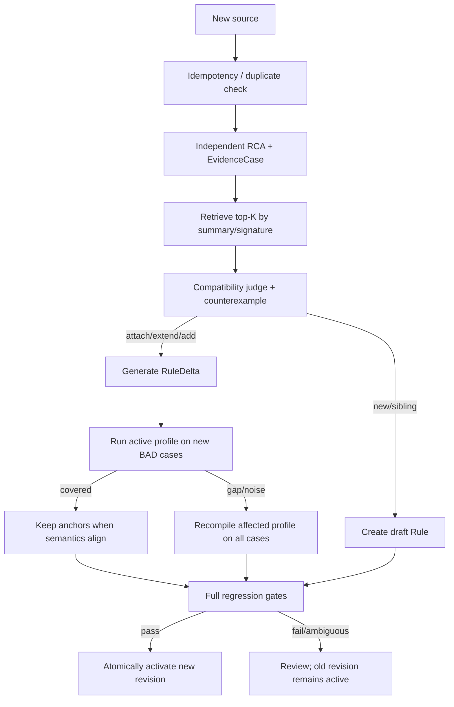

# VAMiner 仓库级规则生成与增量 Rule 演进

> 状态：架构头脑风暴，不包含代码修改
>
> 日期：2026-07-24
>
> 核心结论：先形成独立、不可变的缺陷证据，再判断 attach、extend、add、sibling 或 new；不要让 Agent 原地合并两份 Rule JSON。

相关文档：

- [SDK 与 Agent CLI 双运行时](brainstorm_agent_runtime.md)
- [缺陷场景与 GoodCase/BadCase 输入](brainstorm_case_bundle_input.md)

## 1. 问题重述

当前隐含链路接近：

```text
1 issue -> 1 workspace -> 1 RCA -> 1 VAS -> 保存
```

它适合验证“能否从单个缺陷生成一条规则”，不适合长期维护 Rule catalog。真实关系更可能是：

```text
1 source -> 1..N EvidenceCase
N EvidenceCase -> 1 RuleDefinition
1 RuleDefinition -> N RuleRevision
1 RuleDefinition -> N language DetectionProfile
N related RuleDefinition -> 1 RuleFamily
```

其中 source 不只可以是 CVE/issue，还可以是包含 GoodCase/BadCase 的 benchmark bundle。两种输入在进入 `EvidenceCase` 后，共用相同的候选召回、兼容性判断、增量编译和发布流程。

## 2. 当前实现的 gap

| 维度 | 当前形态 | 增量演进需要 |
|---|---|---|
| 基数 | source 首次进入即分配一个 VAS | source、EvidenceCase、Rule many-to-many |
| RCA | 默认一个 issue 形成一个结果 | 一条 issue 可拆出多个独立 root cause |
| `sources[]` | schema 是 list，组装时通常只写一个 | 真正的多来源 provenance |
| registry | source string 映射到一个 VAS id | evidence id、revision、split/merge 历史 |
| workspace | issue、repo、case、Rule 同生命周期 | Evidence workspace 与 Rule workspace 分离 |
| semantics | 一个 summary + 扁平 unsafe/safe | 有 scope 的 scenario group |
| anchor | 与 Rule/source 混在最终 JSON | language profile、scenario ref、coverage |
| language | 一条 Rule 一个 language | 语义 Rule 与语言 DetectionProfile 分离 |
| update | 固定路径覆盖保存 | immutable revision + active pointer |
| validation | 主要看正例 coverage | 全部历史正例、安全用例、candidate cost 与单调性 |

这里最关键的 gap 不是存储技术，而是领域对象没有分开。若先做“读取旧 JSON，让 LLM 改写后覆盖”，后面很难恢复 provenance、解释 anchor 为什么存在，也无法可靠回滚。

## 3. 推荐的领域对象

### 3.1 `EvidenceCase`：不可变缺陷事实

一个独立 root cause 的证据包：

- `evidence_id`
- source reference
- RCA artifact
- semantic fingerprint
- original bad/positive cases
- synthetic variants（明确标注 synthetic）
- good/fixed cases
- language
- evidence kind 与 provenance

Issue 输入可以附带 repo、buggy/fixed commit 和 diff；CaseBundle 输入可以附带 scenario、显式 Good/Bad case 和 pair 关系。不能为了复用 schema 给后者伪造 repo/commit。

Evidence 修订应生成新 artifact，而不是覆盖已参与旧 revision 的事实。

### 3.2 `RuleFamily`：知识归类

Family 表达宽泛的共同规范，例如：

> Security-sensitive identity decisions require equivalent identifiers to use a canonical representation.

它用于检索、导航和组织 sibling Rule，不直接部署扫描。Family 可以比 executable Rule 更宽。

### 3.3 `RuleDefinition`：保持可执行内聚的语义 Rule

包含：

- summary；
- semantic signature；
- scenario groups；
- evidence refs；
- family ref；
- 不包含具体语言 query。

### 3.4 `DetectionProfile`：语言相关编译产物

包含：

- `rule_id + rule_revision`；
- language/ecosystem；
- anchors；
- anchor 到 scenario group 的引用；
- case coverage matrix；
- 可选 repo evidence；
- candidate volume、unique contribution 等指标。

核心原则：

> Rule 是源定义，anchors 是可重编译产物；不要手工拼接两组 anchors。

### 3.5 `RuleRevision`：不可变发布单元

包含：

- parent revision；
- incoming evidence ids；
- merge decision；
- semantic delta；
- 受影响的 DetectionProfile；
- validation report；
- review/activation status。

active Rule 只是指向一个已验证 revision 的 pointer。新 revision 未通过时，旧 revision 始终有效。

## 4. Scenario group：解决 safe condition 串扰

当前扁平结构可近似为：

```text
violation =
  (unsafe_1 OR unsafe_2 OR ...)
  AND NOT (safe_1 OR safe_2 OR ...)
```

合并多个机制后，某个机制的 safe condition 可能错误否定另一个机制。建议改为：

```text
violation(rule, code) =
  OR for each scenario group g:
    unsafe_g(code) AND NOT any(safe_g(code))
```

概念示例：

```json
{
  "rule_id": "RULE-0012",
  "family_id": "FAMILY-CANONICAL-IDENTITY",
  "revision": 4,
  "summary": "Security-sensitive hostname decisions must use the canonical representation required by the comparison domain.",
  "signature": {
    "subject": "hostname identity",
    "critical_operation": "security policy decision",
    "required_invariant": "equivalent hostnames compare in one canonical domain",
    "failure_mode": "representation mismatch bypasses policy"
  },
  "scenario_groups": [
    {
      "id": "idn-before-policy",
      "unsafe": [
        "A policy decision uses an internationalized hostname before IDN-to-ASCII normalization."
      ],
      "safe": [
        "IDN normalization is completed before each policy decision."
      ],
      "evidence_refs": ["EVIDENCE-0017"]
    }
  ]
}
```

当前 scanner 对额外字段严格校验，因此这应作为显式 schema 演进，而不是偷偷向 v1 JSON 塞字段。

## 5. `summary only` 的正确位置

用户提出“先只看 rule summary 判断能否合并”，适合作为候选召回，不适合作为最终 merge 判定。

### 5.1 可以只看 summary

从 Rule catalog 中取 top-K：

- SQLite FTS/关键词；
- embedding similarity；
- LLM 粗分类。

目标是高 recall，误召回只增加少量 judge 成本。

### 5.2 不能只看 summary

不能仅凭 summary 自动执行：

- 合并 Rule；
- 改写旧 summary；
- 修改或删除旧 scenario；
- 替换或删除 anchor。

summary 是有损描述。两条 summary 可能相似，但 trigger、critical operation、equivalence relation、failure mode 和 fix guarantee 完全不同。

### 5.3 RCA 同时生成 semantic fingerprint

建议最少包含：

- `subject`
- `critical_operation`
- `trigger_context`
- `required_transform_or_order`
- `violated_invariant`
- `failure_mode`
- `trust_source`
- `fix_guarantee`

summary 负责检索；fingerprint、scenario group 与原始证据负责 compatibility decision。

## 6. 合并不是二元选择

建议 judge 返回：

| Decision | 含义 | 动作 |
|---|---|---|
| `DUPLICATE_EVIDENCE` | 同一根因或同一修复的重复来源 | 只挂 source/evidence |
| `ATTACH_TO_GROUP` | 完整落入已有 scenario group | 增 provenance，检查 profile coverage |
| `EXTEND_GROUP` | 同一机制的新 trigger/shape | 扩展该 group，按需重编译 |
| `ADD_GROUP` | 同一 Rule invariant 下的独立机制 | 新增配对 group |
| `SIBLING_IN_FAMILY` | 共同规范相似，但 executable reasoning 不内聚 | 新建 sibling Rule |
| `NEW_FAMILY` | 不属于现有规范 | 新建 Family + Rule |
| `CONFLICT_REVIEW` | 新旧 unsafe/safe/RCA 冲突 | 停在 review，不发布 |

这比“merge/new”更符合实际，也给 Rule 保留可拆分空间。

## 7. 两条候选路线的取舍

| 路线 | 优点 | 风险 |
|---|---|---|
| 先给新缺陷生成完整 Rule，再合并 | 保留独立视角 | 新 anchors 多半浪费；两个完整 JSON 难做可靠字段级 merge |
| 先读旧 Rule，再直接扩增 | 成本低、术语稳定 | confirmation bias；容易把新机制强塞进旧 Rule |
| **先生成 EvidenceCase，再对候选 Rule 生成 RuleDelta** | 保留独立事实，同时只改必要字段 | 需要 evidence/revision 模型，但长期最清楚 |

推荐第三种。这里“独立”不等于先生成一个可发布的新 Rule，而是先产出足以脱离旧 Rule 复核的 RCA、case 和 fingerprint。

## 8. 增量算法



### 8.1 幂等与重复检测

Issue source 可比较：

- normalized issue id；
- repo identity；
- buggy/fixed commit；
- fix diff digest；
- RCA digest。

CaseBundle source 可比较：

- bundle id；
- normalized case content digest；
- case/pair identity。

MVP 可以用文件 artifact + SQLite catalog，不需要先引入重型数据库。

### 8.2 独立 RCA

不要向 RCA Agent 暴露候选 Rule，避免它为了迎合旧结论改写事实。

输出允许：

- 一条 source 拆成多个 EvidenceCase；
- safe guarantee 不足时明确 unknown；
- original、fixed、synthetic、benchmark case 分开；
- scenario 文本与代码冲突时记录冲突。

### 8.3 候选召回

MVP：

1. summary + fingerprint fields 做 FTS；
2. 取 top-K；
3. 只对 top-K 做 pairwise compatibility judge。

规模上来以后再加 embedding。检索 implementation 不应先于领域模型决定架构。

### 8.4 Compatibility judge

Judge 必须回答：

- 共同不变量是什么？
- 新 evidence 是否完整落入旧 scope？
- 哪个最小反例能证明不应合并？
- 旧 safe condition 会不会错误排除新 unsafe？
- 合并后的 summary 是否仍足够具体？
- detection surface 和 candidate economics 是否仍内聚？
- 应 attach、extend、add group，还是 sibling？

输出必须是结构化 decision + reasoning artifact，不能直接覆盖 Rule。

### 8.5 RuleDelta

允许的显式操作：

- `attach_evidence`
- `add_scenario_group`
- `extend_scenario_group`
- `propose_summary_revision`
- `recompile_profile(language)`
- `split_rule`

Agent 不能返回一份“完整新 JSON”并覆盖 active revision。

### 8.6 先跑旧 anchors，再决定是否重编译

1. 用 active DetectionProfile 跑新 BAD cases。
2. 不只看“是否有命中”，还要检查命中是否位于 RCA hotspot，behavior 是否相关。
3. 若新 case 全覆盖且 candidate navigation 合理，尽量保持 anchors 不变。
4. 若有 coverage gap，把旧 anchors 作为 baseline，与全部新旧 evidence 一起重编译。
5. 允许 add/merge/replace/drop，但 drop 必须证明旧 coverage 与独特 navigation value 未丢失。

不建议先为新缺陷生成一套 anchors，再与旧 query 数组拼接。那会不断增加重复召回和候选噪声。

## 9. 各字段怎样演进

### 9.1 Summary

1. 旧 summary 已覆盖：不改。
2. 只需最小 generalization，且仍可操作：提出 revision。
3. 必须变成“properly/safely/correctly”一类空泛原则才能覆盖：不要 merge，建 sibling。

修改前要求两个 counterexample：

- 满足新 summary、但显然不应由该 Rule 扫描的代码；
- 旧 Rule 应检测、但新 summary 可能漏掉的代码。

### 9.2 Scenario

- 语义等价：attach evidence；
- 同一 mechanism 的 trigger/shape 变体：extend group；
- 同一 invariant 的独立 mechanism：add group；
- fix guarantee 冲突：review，不把 safe 条件简单取并集。

### 9.3 Anchor

- 每个 BAD original/variant 至少有一个相关 anchor；
- 每个 anchor 要有独特 coverage 或 materially different navigation value；
- anchor 关联 scenario group；
- 无质量收益时避免 churn；
- GoodCase 被 anchor 命中不一定是错，最终 verdict 由语义 analyzer 决定。

可以把编译目标理解为：

```text
minimize:
  candidate volume + λ * anchor count + μ * anchor churn

subject to:
  all historical BAD cases remain covered
  all queries execute successfully
  each anchor has unique coverage/navigation value
  downstream analysis preserves GoodCase expectations
```

## 10. 验证 gate

| Gate | 内容 |
|---|---|
| Schema | Evidence、RuleDelta、Rule、Profile、Revision 严格校验 |
| Evidence integrity | provenance 可追溯；real/synthetic/benchmark 分开 |
| Semantic | decision 有共同不变量与反例；safe 不跨 group |
| BAD anchor recall | 全部新旧 BAD cases 有相关召回 |
| Repo grounding | 有 repo source 时，anchor 有真实 buggy evidence |
| Case grounding | 无 repo 时，以 CaseBundle span 作为合法 evidence |
| Good analysis | downstream analyzer 对 GoodCase 不报预期缺陷 |
| Monotonicity | 旧已支持缺陷不得无解释消失 |
| Retrieval cost | candidate volume、raw matches、unique contribution 在预算内 |
| Churn | summary/scenario/anchor diff 在预算内 |
| Transaction | base revision 未变化，通过后才切 active pointer |

自动化建议：

- Tier 0：duplicate/no-op，可自动。
- Tier 1：attach，summary/anchors 不变且全 gate 通过，可逐步自动。
- Tier 2：extend/add group、新 anchor，早期人工 review。
- Tier 3：summary generalization、safe 语义变化、anchor 删除、split/merge，人工 review。

## 11. Rule 必须可拆分

只有 merge 的长期系统必然产生巨型规则。以下是 split signal：

- scenario groups 不再共享 executable invariant；
- candidate volume 上升而 warning yield 下降；
- anchor 与 scenario group 构成两个近乎不相连的子图；
- analyzer 经常在同一 Rule 内选择错误 group；
- summary 只能依赖空泛措辞。

Split 也生成 revision，并保留：

- old Rule alias；
- evidence 迁移映射；
- finding 去重映射；
- scanner compatibility window。

## 12. Repository bootstrap 与日常增量

### 12.1 Repository bootstrap

首次处理大量历史 issue 时，不应按时间顺序让第一条 Rule 吞掉后续输入：

1. 建立 RepositorySnapshot，复用 clone/object store；
2. 收集 issue/fix，按 commit、diff、source 初步去重；
3. 为每个独立 root cause 生成 EvidenceCase；
4. 按 fingerprint 粗 cluster；
5. cluster 内做 pairwise compatibility 和反例检查；
6. 发现 RuleFamily，再生成 executable-coherent Rule；
7. 按语言编译 DetectionProfile；
8. 全 corpus 验证后批量发布初始 revisions。

### 12.2 Incremental ingest

catalog 稳定后，新 issue 或新 CaseBundle 走 retrieve → judge → RuleDelta → profile validation → revision publish。

可定期离线 re-cluster，但只提出 split/merge proposal，不直接更改 active Rule。

## 13. 与现有 VAS-0002 / VAS-0003 的具体关系

两者共同点：

- 都属于 hostname/domain identity；
- 都要求安全决策使用 canonical representation；
- 都可能因 representation mismatch 绕过 policy。

但它们的 equivalence relation、critical operation、required transform、fix guarantee 和 anchor surface 不同：

```text
RuleFamily: Canonical identity before security policy
  ├─ Rule: Canonical case for domain suffix decisions
  └─ Rule: IDN normalization before hostname policy lookup
```

当前扁平 unsafe/safe schema 下不建议合并。即便采用新模型，默认也应是同一 Family 下的 sibling Rule，而不是为减少数量强行合成一条。

## 14. 推荐落地顺序

1. 定义 `EvidenceCase` 和 source tagged union。
2. 将现有 VAS 表示为 `RuleDefinition + DetectionProfile`，先只做兼容输出。
3. 引入 scenario group 和 scoped safe semantics。
4. 增加 immutable RuleRevision 与 active pointer。
5. 上线只读的 top-K retrieval + compatibility dry run。
6. 先自动化 duplicate/no-op 和 attach。
7. 再做 coverage-driven profile recompile。
8. 最后考虑 summary generalization、Rule split/merge 和 Repository bootstrap。

## 15. 最终建议

对“先生成新规则再合并”与“先看旧规则再扩增”的折中答案是：

> 先生成独立 `EvidenceCase`，再针对候选 Rule 生成最小 `RuleDelta`；只有 profile coverage 不足时，才基于全部新旧证据重编译 anchors。

这样可以同时避免旧 Rule 的确认偏差和新 Rule/anchor 的无效重复，也让 Issue 与 GoodCase/BadCase 两类输入共用同一条增量演进链路。

